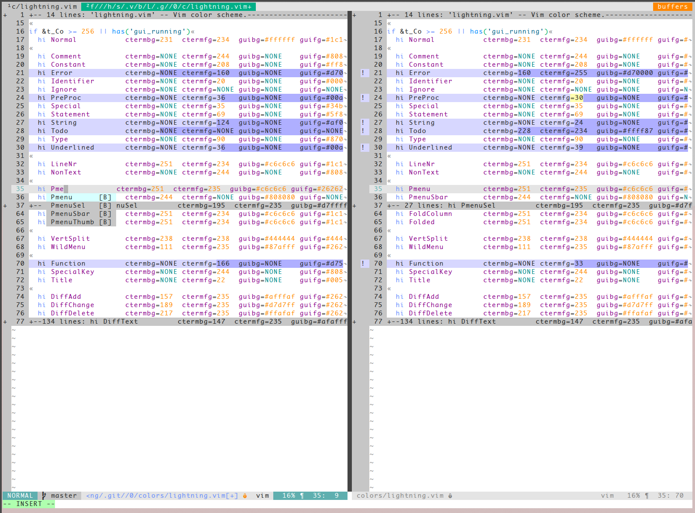
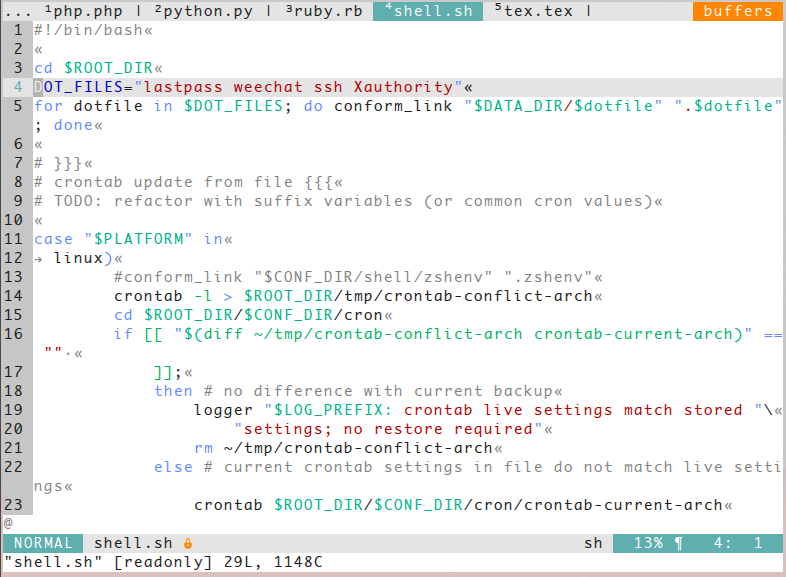
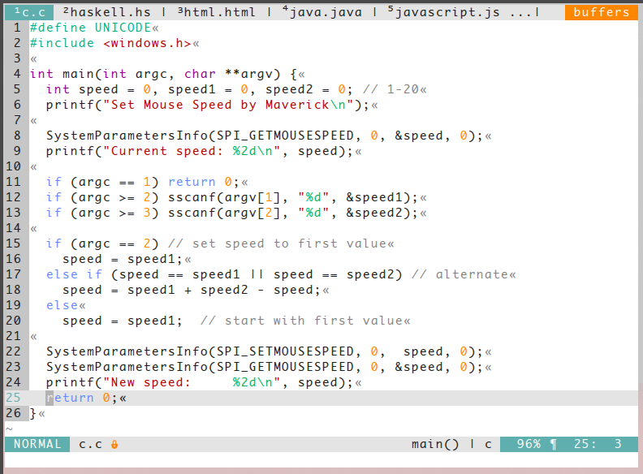
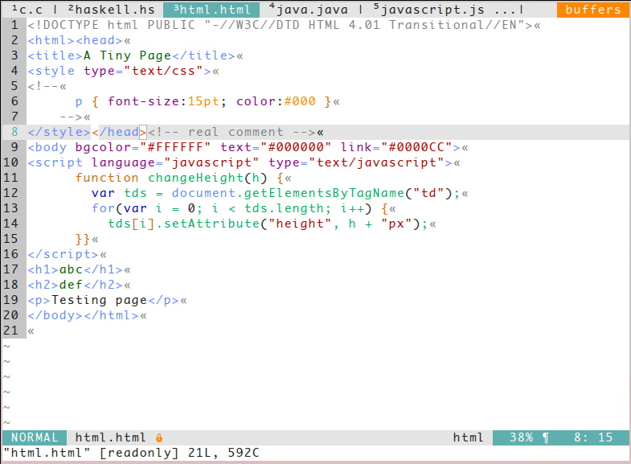
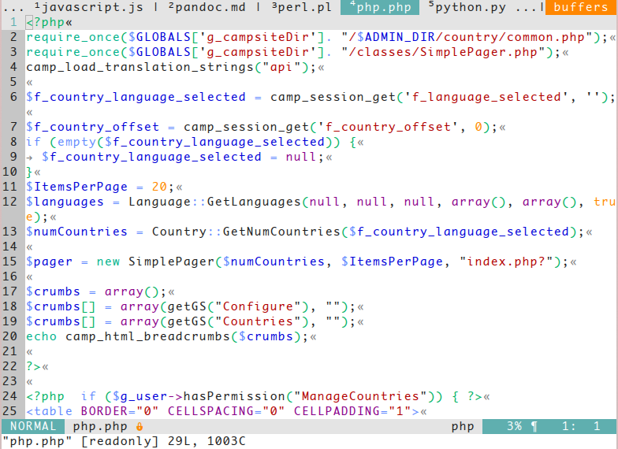
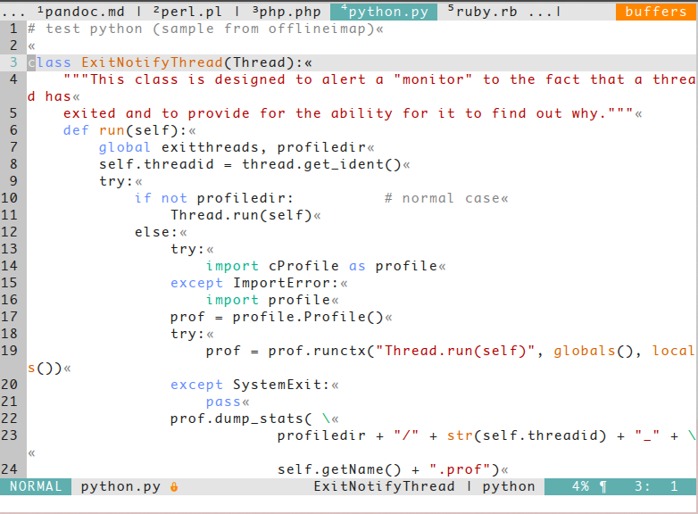
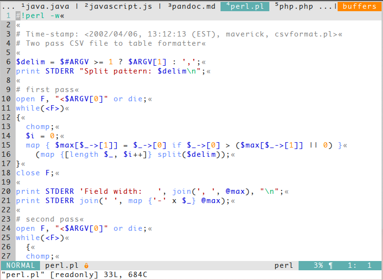

# Lightning
A light colorscheme for vim based on Apprentice by Romain Lafourcade.
It has 16 and 256 colours support for both terminal and GUI.

[NOTE]
This is a work in progress.

## Screenshots
**Vim diff**

**Shell**

**C**

**HTML**

**PHP**

**Python**

**Perl**

## Installation
Copy colors/lightning.vim to $HOME/.vim/colors/

Or use a vim plugin manager:

| Plugin manager                                         | In vimrc                         | Installation command |
|--------------------------------------------------------|----------------------------------|----------------------|
| [NeoBundle](https://github.com/Shougo/neobundle.vim)   | `NeoBundle 'wimstefan/Lightning'` | `NeoBundleInstall`     |
| [Vim-plug](https://github.com/junegunn/vim-plug)       | `Plug 'wimstefan/Lightning'`      | `PlugInstall`          |
| [Vundle](https://github.com/gmarik/Vundle.vim)         | `Plugin 'wimstefan/Lightning'`    | `PluginInstall`        |
